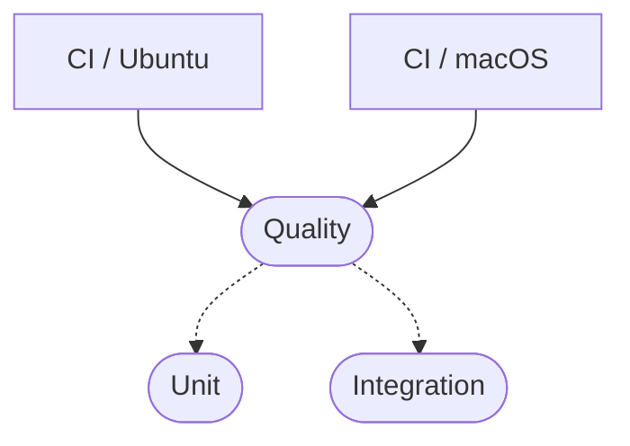

# CI Pipelines

## Pipeline Graph

## Workflow Layout

- [`.github/workflows/ci-ubuntu.yml`](../.github/workflows/ci-ubuntu.yml) is the Ubuntu entry workflow.
- [`.github/workflows/ci-macos.yml`](../.github/workflows/ci-macos.yml) is the macOS entry workflow.
- [`.github/workflows/quality.yml`](../.github/workflows/quality.yml) defines reusable quality and compilation checks.
- [`.github/workflows/unit.yml`](../.github/workflows/unit.yml) defines reusable unit and doc test execution.
- [`.github/workflows/integration.yml`](../.github/workflows/integration.yml) defines reusable integration test execution.

## Job Order

`CI / Ubuntu` and `CI / macOS` both route into the same logical pipeline shape. `quality` runs first, then `unit` and `integration` both depend on `quality`, so formatting, linting, and compile validation must pass before the test fan-out begins.

## Quality Workflow

The quality workflow performs static validation and build verification before tests run.

### Rustfmt

- `cargo +nightly fmt --all` checks formatting consistency by reformatting the workspace.
- The workflow fails if formatting would change tracked files.

### Clippy

- `cargo clippy --all-features --all-targets -- -D warnings` runs lints across all targets and features.
- `-D warnings` promotes warnings to errors so the job fails on any lint finding.

### Feature Compile Checks

This catches missing imports, cfg mistakes, and feature-gating regressions without requiring full test execution for every combination.

### Docs.rs Feature Set

- `RUSTDOCFLAGS='--cfg docsrs' cargo doc --all-features --no-deps` validates that documentation builds under a docs.rs-like configuration.
- This helps catch documentation-only compilation issues and cfg-gated API doc failures.

## Unit Workflow

The unit workflow focuses on fast correctness checks that do not require the broader integration feature matrix.

## Integration Workflow

The integration workflow exercises feature-backed behavior and the broader end-to-end test matrix.
