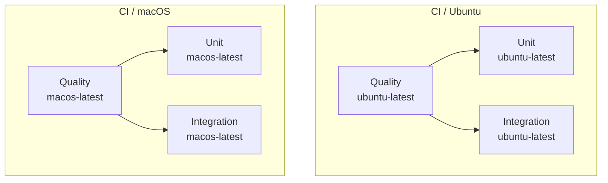

# CI Pipelines

SparseIO uses two top-level GitHub Actions pipelines:

- `CI / Ubuntu`
- `CI / macOS`

Both pipelines share the same reusable component workflows for quality checks, unit tests, and integration tests. The only difference between them is the runner OS.

## Pipeline Graph

## Workflow Layout

- [`.github/workflows/ci-ubuntu.yml`](../.github/workflows/ci-ubuntu.yml) is the Ubuntu entry workflow.
- [`.github/workflows/ci-macos.yml`](../.github/workflows/ci-macos.yml) is the macOS entry workflow.
- [`.github/workflows/quality.yml`](../.github/workflows/quality.yml) defines reusable quality and compilation checks.
- [`.github/workflows/unit.yml`](../.github/workflows/unit.yml) defines reusable unit and doc test execution.
- [`.github/workflows/integration.yml`](../.github/workflows/integration.yml) defines reusable integration test execution.

## Job Order

`quality` runs first in each OS pipeline. `unit` and `integration` both depend on `quality`, so formatting, linting, and compile validation must pass before the test fan-out begins.

## Quality Workflow

The quality workflow performs static validation and build verification before tests run.

### Rustfmt

- `cargo +nightly fmt --all` checks formatting consistency by reformatting the workspace.
- The workflow fails if formatting would change tracked files.

### Clippy

- `cargo clippy --all-features --all-targets -- -D warnings` runs lints across all targets and features.
- `-D warnings` promotes warnings to errors so the job fails on any lint finding.

### Feature Compile Checks

This catches missing imports, cfg mistakes, and feature-gating regressions without requiring full test execution for every combination.

### Docs.rs Feature Set

- `RUSTDOCFLAGS='--cfg docsrs' cargo doc --all-features --no-deps` validates that documentation builds under a docs.rs-like configuration.
- This helps catch documentation-only compilation issues and cfg-gated API doc failures.

## Unit Workflow

The unit workflow focuses on fast correctness checks that do not require the broader integration feature matrix.

### Unit Tests

- `cargo nextest run --features utils` runs the main unit-oriented test set with the `utils` feature enabled.

### Debug Harness Tests

- `cargo nextest run --features utils,debug` runs tests that require the debug harness feature set.

### Doc Tests

- `cargo test --doc --all-features` executes Rust documentation tests across the full feature set.

## Integration Workflow

The integration workflow exercises feature-backed behavior and the broader end-to-end test matrix.

### File Feature Integration Tests

- `cargo nextest run --features utils,file` runs integration coverage for the file-backed reader and writer implementation.

### HTTP Feature Integration Tests

- `cargo nextest run --features utils,http` runs integration coverage for the HTTP reader implementation.

### Full Feature Matrix

- `cargo nextest run --all-features` runs the broadest integration-oriented test configuration.
- This acts as the final end-to-end feature-combination check inside the integration workflow.
