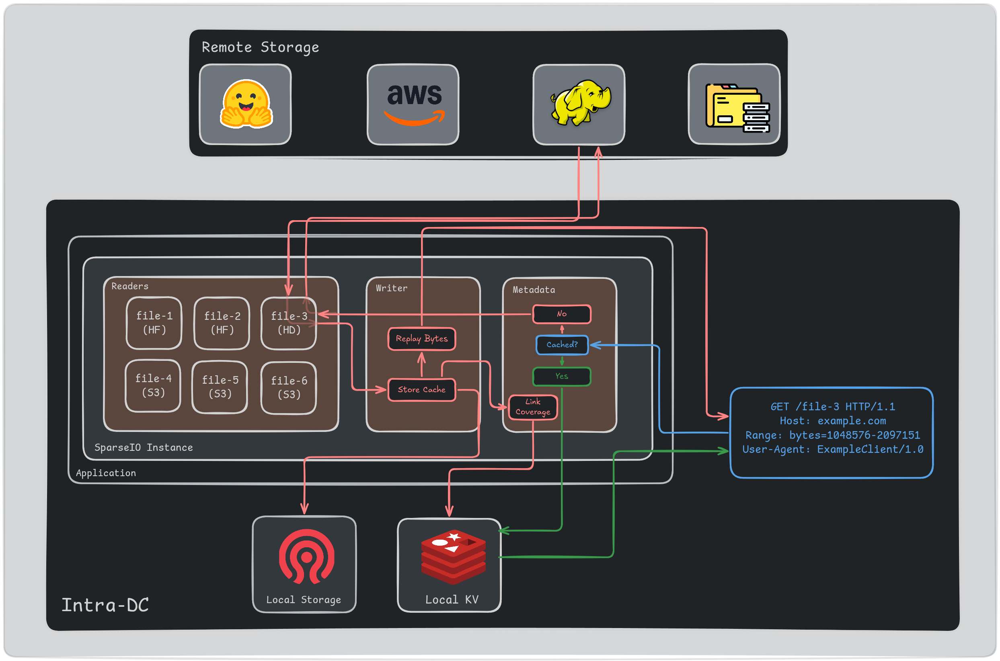

# Trait API

## Reader

The Reader component is responsible for reading data from the upstream data source. This could be an S3 bucket,
a HuggingFace repository, a remote FTP server, or any other distant data source. The only requirement is the
ability to read explicit byte ranges from the data source. As such the user must provide two functions to
produce a functional Reader:

- `func len() -> usize`: The number of bytes in the data source.
- `func read(offset: usize, length: usize) -> io::Result<Bytes>`: Read a byte range from the data source.

**Note**: It is up to the Developer to ensure access patterns made by the Reader are efficient for the underlying
data source (i.e. managing rate limits, connection pooling, etc.). SparseIO will not attempt to optimize access patterns
for the Reader to keep genericity and flexibility.

## Writer

The Writer component is responsible for writing data to the downstream cache in order to optimize access
speeds on future reads. This could be a local disk, a remote cache server, or any other location where data
can be written. As such the user is expected to provide three functions to produce a functional Writer:

- `func write(key: &str, offset: usize, data: Bytes)`: Write a byte range to the cache.
- `func read(key: &str, offset: usize, length: usize) -> Result<Option<Bytes>>`: Read a byte range from the cache.
- `func delete(key: &str)`: Delete a key from the cache.

## Metadata

The Metadata component is responsible for keeping track of the data in the cache, the state of cache coverage for
individual data sources, and other relevant metadata for the application. As such it is just a generic interface
to a key-value store and the user is expected to provide three functions to produce a functional Metadata store:

- `func get(key: &str) -> Result<Option<Bytes>>`: Get a value from the metadata store.
- `func set(key: &str, value: Bytes)`: Set a value in the metadata store.
- `func delete(key: &str)`: Delete a key from the metadata store.

## Sample User Application Diagram

