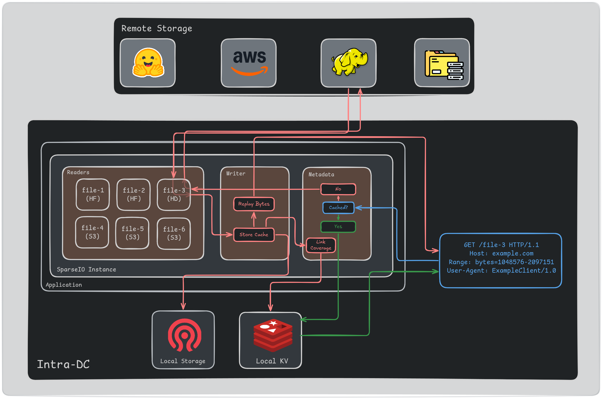

# Trait API

Backend traits transfer payloads as owned [`Bytes`][bytes] values so large ranges can
move across the API without requiring an additional buffer copy.

## `Reader`

The `Reader` trait is responsible for reading data from the upstream data source. This could be an S3 bucket,
a HuggingFace repository, a remote FTP server, a custom user-defined storage service, or any other distant data source.
The only requirement is the ability to read explicit byte ranges from the data source. As such the user must provide
two functions to produce a functional `Reader`:

- `async fn len(&self) -> io::Result<usize>`: Return the number of bytes in the data source.
- `async fn read_at(&self, offset: usize, length: usize) -> io::Result<Bytes>`: Read a byte range from the data source.

**Note:** It is up to the developer to ensure access patterns made by the `Reader` are efficient for the underlying
data source (i.e. managing rate limits, connection pooling, etc.). SparseIO will not attempt to optimize access patterns
for the `Reader` to preserve generality and flexibility.

## `Writer`

The `Writer` trait is responsible for writing data to the downstream cache in order to optimize access
speeds on future reads. This could be a local disk, a remote cache server, or any other location where data
can be written. As such the user is expected to provide three functions to produce a functional `Writer`:

- `async fn write(&self, key: &str, value: Bytes) -> io::Result<()>`: Write `value` to the cache under `key`.
- `async fn read(&self, key: &str) -> io::Result<Option<Bytes>>`: Read bytes from the cache under `key`.
- `async fn delete(&self, key: &str) -> io::Result<()>`: Delete a key from the cache.

## `Metadata`

The `Metadata` trait is responsible for keeping track of the data in the cache, the state of cache coverage for
individual data sources, and other relevant metadata for the application. As such it is just a generic interface
to a key-value store and the user is expected to provide four functions to produce a functional `Metadata` store:

The `Metadata` trait does not provide transactional, locking, versioning, or retry semantics. A
[`SparseIO`](./OBJECTS.md#sparseio) instance may make concurrent requests to the metadata store, and multiple
instances or processes may share the same backend.
The consumer providing the `Metadata` implementation is responsible for preserving consistency across those
requests. Depending on the backend and stored data, this may require per-key locking or leases, versioned values
with conditional updates, idempotent operations, and retries when concurrent updates conflict or transient
operations fail.

- `async fn get(&self, key: &str) -> io::Result<Option<Bytes>>`: Get a value from the metadata store.
- `async fn set(&self, key: &str, value: Bytes) -> io::Result<()>`: Set a value in the metadata store.
- `async fn delete(&self, key: &str) -> io::Result<()>`: Delete a key from the metadata store.
- `async fn scan_prefix(&self, prefix: &str) -> io::Result<Vec<(String, Bytes)>>`: Return entries whose keys start with `prefix`.

## Backend Validation

SparseIO aims to provide targeted conformance tests and debugging harnesses for custom backend implementations.
Each harness isolates the backend under test by supplying known-good in-memory implementations for the other
traits. For example, a consumer testing a `Metadata` implementation can run it with the reference `Reader` and
`Writer` implementations rather than diagnosing all three components at once.

These harnesses will provide examples of expected behavior and deterministic workloads for concurrency,
contention, retries, failures, and cache lifecycle transitions. They are intended to expose common consistency
and integration vulnerabilities early, but they do not replace the guarantees or production configuration of the
underlying metadata store. See [Trait Validation](../testing/VALIDATION.md) for the intended API, isolation model, and
validation workloads.

## Sample User Application Diagram

[bytes]: https://docs.rs/bytes/latest/bytes/struct.Bytes.html
