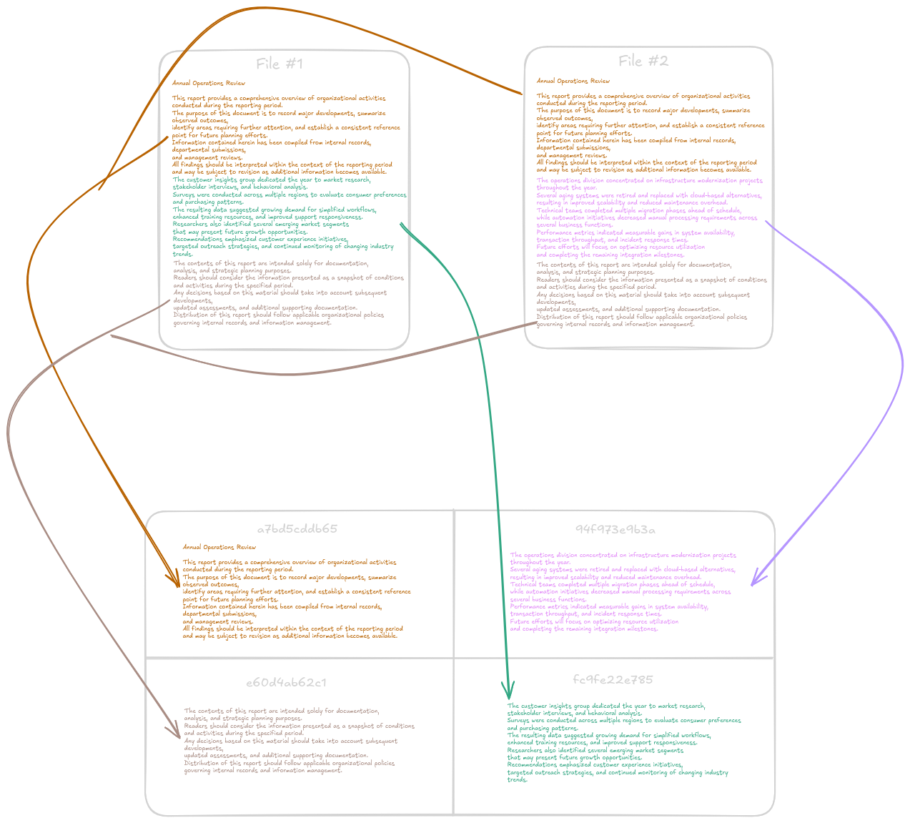

# Content-Addressable Storage (CAS)

In order to optimize our cache storage efficiency we utilize a content-addressable storage (CAS) system.
Large storage services take advantage of this for files that may be duplicated with only partial differences.
This can be especially useful for AI/ML workloads and is exactly how HuggingFace stores their models and
datasets through their XET architecture. It also has its uses in storage of database backups, ISOs, and more.

Below you can see a simple example of how CAS deduplicates data. In this example we have two documents that are
mostly the same except for the middle paragraph. Rather than caching 6 chunks of data total (3 for each document),
we are able to dedupe the first and last chunk, resulting in only 4 chunks of data being stored in our cache. In
something like a SFT (Supervised Finetuned) model, this can be a huge space saver as large amounts of tensors may
remain unchanged, or for full database backup where only a few records may have changed since the last backup.

In our architecture when a read request is initially made for a file we first check in our Metadata store to see
if we have the data for that file at the requested offset, this is precisely why chunk lengths are declared immutable,
we assert that you cannot construct a SparseIO instance from a metadata store tracking a different chunk size.
If we don't have the chuk we retrieve the data using a Reader and calculate the SHA256 hash of the requested byte range
and check if it exists already in our cache. If it does we can just map the key for that specific offset in the file to
the hash of the respective chunk. Otherwise we use our Writer to write the chunk to cache while also mapping the key.
This is where the content-addressable part comes in, we are using the hash of the content to map it as a location
in our cache.

The problem with this approach however is that we are unable to invalidate cache when a file is removed
or an eviction policy is triggered. As such we use a separate key in our metadata store to keep track of the
reference count for each hash in our cache. If we attempt to delete a chunk from cache and the reference count
is greater than 1 we just decrement the reference count and leave the chunk in cache. In the case that it ends up
being 1 we know we can safely delete the chunk.
