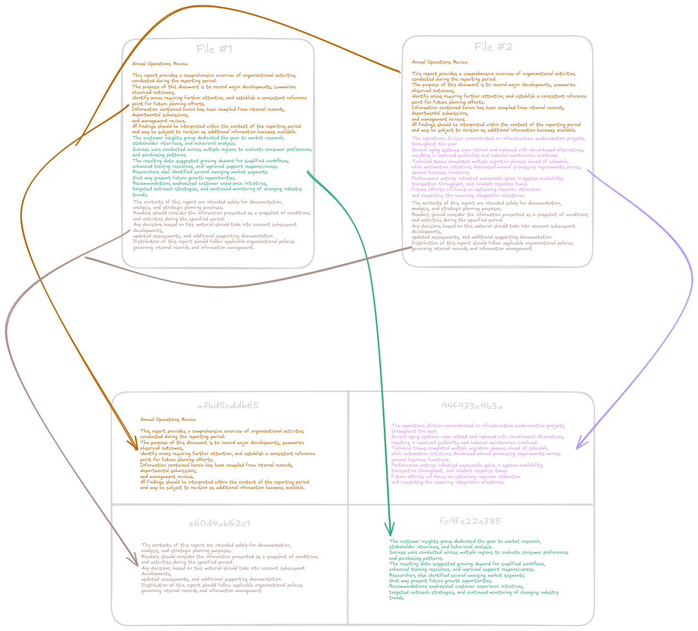

# Content-Addressable Storage (CAS)

SparseIO uses content-addressable storage (CAS) to improve cache efficiency when large
objects contain repeated data. This is especially useful for AI/ML artifacts, database
backups, disk images, and other objects whose versions differ by only a subset of their
chunks. Hugging Face uses the same general approach in its [Xet storage backend][hf-xet].

The diagram below shows two documents that differ only in their middle chunk. Rather
than caching six chunks in total, CAS shares the matching first and last chunks and
stores only four unique chunks. This can save substantial space for a supervised
fine-tuned model whose tensors mostly remain unchanged or for a full database backup
in which only a few records changed.

## Insertion

When a range is requested, SparseIO first checks the configured
[`Metadata`](./API.md#metadata) store for a mapping at the requested object offset.
Chunk size is immutable for a [`SparseIO`](./OBJECTS.md#sparseio) instance because an
existing coverage map is meaningful only when readers use the same chunk boundaries.

If no mapping exists, the [`Reader`](./API.md#reader) fetches the chunk and SparseIO
calculates its SHA-256 content hash. An existing hash can be mapped to the object offset
without storing the bytes again. Otherwise, the [`Writer`](./API.md#writer) stores the
new chunk under its hash before the metadata mapping is published.

## Deletion

Invalidation is more complicated because several object offsets may refer to the same
CAS chunk. A strict reference count is tempting, but it requires the metadata backend
to provide an atomic decrement or update operation to stay correct across concurrent
or distributed deletes. Versioning has the same requirement unless the backend also
supports conditional writes. SparseIO keeps these coordination primitives out of the
core [`Metadata`](./API.md#metadata) API.

Instead, CAS chunks are treated as a loose cache. Each chunk has an expiry key in
metadata, and inserting, reading, or marking a referenced chunk sets that expiry to
`now + cache_lifetime`. A garbage-collection (GC) pass can scan metadata mappings,
refresh expiry keys for referenced chunks, and delete expired chunks from both
metadata and cache. If a stale mapping points to a missing chunk, the
[read path](./FLOW.md#read-path) treats it as a cache miss and fetches the data from the
upstream source again.

GC is process-specific, so a `gc_lock` metadata key prevents multiple processes from
running it at the same time. The lock uses touch time to permit recovery when a process
crashes while holding it. A race or duplicate deletion is recoverable because failed
cache reads fall back to the upstream source. See the
[expiry-based lifecycle decision](./DECISIONS.md#expiry-based-cas-lifecycle) for the
trade-offs behind this design.

[hf-xet]: https://huggingface.co/docs/hub/xet/index
